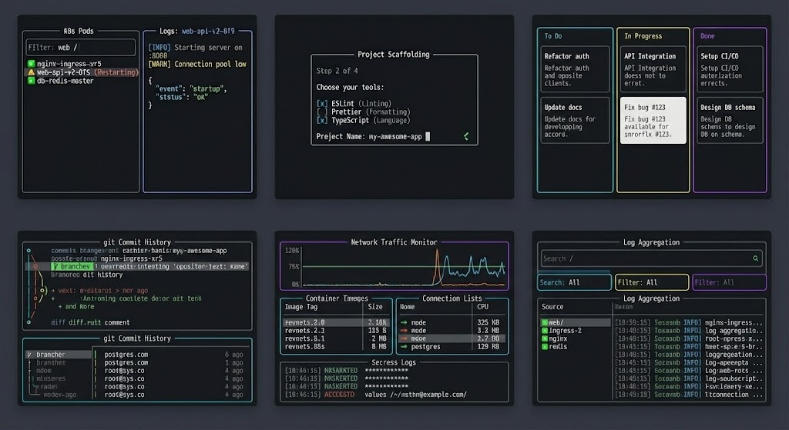

# ACP-sentinel



ACP-sentinel is an F# implementation of the Agent Client Protocol (ACP) plus a validation / sentinel layer.

It aims to give you:

- **Protocol holon**: pure F# types and rules that model "what ACP means".
- **Runtime holon**: transports, clients, and agents (IO, processes, stdio wiring).
- **Sentinel holon**: stateful validation and assurance over ACP traffic.

Normative behavior follows the published ACP spec and schema:

- Spec source of truth (GitHub): <https://github.com/agentclientprotocol/agent-client-protocol>
- Overview/intro (website): <https://agentclientprotocol.com/overview/introduction>

Implementation targets:

- ACP schema: `Acp.Domain.Spec.Schema` (currently `0.10.x`)
- Negotiated major `protocolVersion`: `Acp.Domain.PrimitivesAndParties.ProtocolVersion.current` (currently `1`)

This repo adds an architecture-first view on assurance and observability.

## Quick Start Commands

### Unified CLI Tool

The **`acp-cli`** provides a unified interface for ACP protocol inspection, validation, replay, analysis, and benchmarking:

```bash
# Build the CLI
dotnet build apps/ACP.Cli/ACP.Cli.fsproj -c Release

# Inspect trace files (full validation with colored output)
dotnet run --project apps/ACP.Cli -- inspect trace.jsonl
dotnet run --project apps/ACP.Cli -- inspect --raw trace.jsonl  # Raw JSON output

# Validate messages from stdin (real-time validation)
cat messages.json | dotnet run --project apps/ACP.Cli -- validate --direction c2a

# Interactive replay (step through traces)
dotnet run --project apps/ACP.Cli -- replay --interactive trace.jsonl
dotnet run --project apps/ACP.Cli -- replay --stop-at 5 trace.jsonl  # Stop at frame 5

# Statistical analysis
dotnet run --project apps/ACP.Cli -- analyze trace.jsonl

# Benchmark performance
dotnet run --project apps/ACP.Cli -- benchmark --mode throughput --count 1000
dotnet run --project apps/ACP.Cli -- benchmark --mode cold-start
dotnet run --project apps/ACP.Cli -- benchmark --mode roundtrip
dotnet run --project apps/ACP.Cli -- benchmark --mode codec
dotnet run --project apps/ACP.Cli -- benchmark --mode tokens --tokens 1000000
dotnet run --project apps/ACP.Cli -- benchmark --mode raw-json

# Show version
dotnet run --project apps/ACP.Cli -- --version

# Get help
dotnet run --project apps/ACP.Cli -- --help
dotnet run --project apps/ACP.Cli -- inspect --help
dotnet run --project apps/ACP.Cli -- validate --help
dotnet run --project apps/ACP.Cli -- replay --help
dotnet run --project apps/ACP.Cli -- analyze --help
dotnet run --project apps/ACP.Cli -- benchmark --help
```

**Commands Overview:**

- **`inspect`** - Full Inspector validation from JSONL trace files with detailed findings
- **`validate`** - Real-time validation of ACP messages from stdin
- **`replay`** - Interactive stepping through trace files with validation
- **`analyze`** - Statistical analysis: method counts, timing, session stats
- **`benchmark`** - Performance testing: cold-start, throughput, codec, tokens

### Build SDK

```bash
dotnet build src/ACP.fsproj
```

### Run All Tests

```bash
dotnet test tests/ACP.Tests.fsproj -c Release
```

### Run Specific Test Category

```bash
# Protocol/runtime/sentinel tests
dotnet test tests/ACP.Tests.fsproj --filter "FullyQualifiedName~TraceReplay"

# SDK component tests
dotnet test tests/ACP.Tests.fsproj --filter "FullyQualifiedName~Transport|FullyQualifiedName~Connection|FullyQualifiedName~SessionState|FullyQualifiedName~ToolCalls|FullyQualifiedName~Permissions"
```

### Format Code with Fantomas

```bash
# Format all code
dotnet tool restore && dotnet fantomas src tests apps

# Check formatting only
dotnet tool restore && dotnet fantomas src tests apps --check
```

## Documentation

- Tooling (paths, build/run commands): [docs/tooling/acp-sentinel.md](docs/tooling/acp-sentinel.md)
- FPF (external): <https://github.com/ailev/FPF> — **Note**: FPF is fetched daily to `/tmp/FPF-YYYYMMDD` for evaluation. No local copy is maintained in this repo.
- FPF Alignment: [docs/reports/fpf-alignment-evaluation-20260106.md](docs/reports/fpf-alignment-evaluation-20260106.md)
- SDK docs entrypoint: [docs/index.md](docs/index.md)
- SDK comparison: [docs/SDK-COMPARISON.md](docs/SDK-COMPARISON.md)
- Examples: [examples/](examples/)

## Who benefits (and how)

- **Agent platform teams** — drop-in ACP reference that keeps protocol drift low while you ship fast; the sentinel layer catches malformed turns before they hit production.
- **Runtime integrators** — `Acp.RuntimeAdapter` bridges ACP to your process/stdio boundary;
- **Risk, SRE, and governance** — validation lanes plus golden tests (`tests/`) give repeatable evidence for change control, regressions, and incident postmortems.
- **Enterprise engineering & compliance** — typed protocol core + auditable validation findings reduce vendor risk, ease security reviews, and support regulated change windows.
- **Applied AI researchers & prototypers** — a fully typed F# core and UTS let you explore ACP variants with safety rails and auditable deductions.

### Typical scenarios

- You need to enforce ACP correctness at the IO boundary of an LLM agent runner and want ready-made `validateInbound` / `validateOutbound` gates.
- You're adding a new tool/capability to an ACP agent and want protocol-safe fixtures plus validation findings instead of hand-rolled checks.
- You're mirroring ACP into another language/runtime and need a canonical model + tests to prevent semantic drift.
- You're onboarding teammates or stakeholders and need short, high-signal explainers that match the implementation.

## 60-second getting started

1. Prereqs: .NET 10 SDK. From repo root: `dotnet build src/ACP.fsproj` (restores + builds).
2. Quick probe via F# Interactive (from `src/` after build):

```fsharp
#r "bin/Debug/net10.0/ACP.dll"
open Acp
open Acp.Domain
open Acp.Domain.PrimitivesAndParties
open Acp.Domain.Capabilities
open Acp.Domain.Messaging
open Acp.RuntimeAdapter

let session = SessionId "demo-001"

let inbound =
    RuntimeAdapter.validateInbound session None
        { rawByteLength = None
          message =
            Message.FromClient(
                ClientToAgentMessage.Initialize
                    { protocolVersion = ProtocolVersion.current
                      clientCapabilities =
                        { fs = { readTextFile = true; writeTextFile = false }
                          terminal = false }
                      clientInfo = None }) }
        false

let outbound =
    RuntimeAdapter.validateOutbound session None
        { rawByteLength = None
          message =
            Message.FromAgent(
                AgentToClientMessage.InitializeResult
                    { protocolVersion = ProtocolVersion.current
                      agentCapabilities =
                        { loadSession = true
                          mcpCapabilities = { http = false; sse = false }
                          promptCapabilities = { audio = false; image = false; embeddedContext = false } }
                      agentInfo = None
                      authMethods = [] }) }
        false

printfn "Inbound findings: %A" inbound.findings
printfn "Outbound findings: %A" outbound.findings
```

3. Want to wire it into a runtime?

### Tooling Reference (Holon 2)

- `src/Acp.Domain.fs` — F# domain model: protocol versions, sessions, capabilities, messages, tool calls, etc.
- `src/Acp.Protocol.fs` — protocol state machine (initialize → sessions → prompt turns → updates → cancel).
- `src/Acp.Validation.fs` — validation lanes/findings, protocol-error bridge, `runWithValidation` helper.
- `src/Acp.RuntimeAdapter.fs` — runtime boundary: `validateInbound`/`validateOutbound` with profile-aware checks.
- `tests/` — protocol/runtime/sentinel tests

## SDK Modules

The SDK provides runtime components for building ACP clients and agents, comparable to the official TypeScript and Python SDKs.

### Transport Layer (`Acp.Transport`)

Abstractions for bidirectional communication:

```fsharp
open Acp.Transport

// In-memory transport for testing
let transport = MemoryTransport()
do! transport.SendAsync("message")
let! msg = transport.ReceiveAsync()

// Duplex pair for client-agent testing
let clientTransport, agentTransport = DuplexTransport.CreatePair()

// Stdio transport for process communication
let stdioTransport = StdioTransport(stdin, stdout)
```

### Connection Layer (`Acp.Connection`)

High-level client and agent connections with JSON-RPC correlation:

```fsharp
open Acp.Connection

// Client side
let client = ClientConnection(transport)
let! initResult = client.InitializeAsync({ clientName = "MyClient"; clientVersion = "1.0" })
let! sessionResult = client.NewSessionAsync({})
let! promptResult = client.PromptAsync({ sessionId = sid; prompt = [...]; expectedTurnId = None })

// Agent side
let handlers = {
    onInitialize = fun p -> task { return Ok { agentName = "MyAgent"; agentVersion = "1.0" } }
    onNewSession = fun p -> task { return Ok { sessionId = ...; modes = [...]; currentModeId = ... } }
    onPrompt = fun p -> task { return Ok { sessionId = p.sessionId; outputTurnId = ... } }
    onCancel = fun p -> Task.FromResult()
    onSetMode = fun p -> task { return Ok { currentModeId = p.modeId } }
}
let agent = AgentConnection(transport, handlers)
let! _ = agent.StartListening()
```

### Session State (`Acp.Contrib.SessionState`)

Accumulates streaming session notifications into coherent snapshots:

```fsharp
open Acp.Contrib.SessionState

let accumulator = SessionAccumulator()

// Subscribe to updates
let unsubscribe = accumulator.Subscribe(fun snapshot notification ->
    printfn "Tool calls: %d" snapshot.toolCalls.Count)

// Apply notifications as they arrive
let snapshot = accumulator.Apply(notification)

// Access current state
let toolCalls = snapshot.toolCalls
let currentMode = snapshot.currentModeId
let messages = snapshot.agentMessages
```

### Tool Call Tracking (`Acp.Contrib.ToolCalls`)

Tracks tool call lifecycle with status filtering:

```fsharp
open Acp.Contrib.ToolCalls

let tracker = ToolCallTracker()

// Apply session updates
tracker.Apply(notification)

// Query by status
let pending = tracker.Pending()
let inProgress = tracker.InProgress()
let completed = tracker.Completed()
let failed = tracker.Failed()

// Check if work is ongoing
if tracker.HasInProgress() then ...

// Get specific tool call
match tracker.TryGet("tool-call-id") with
| Some tc -> printfn "Status: %A" tc.status
| None -> ()
```

### Permission Handling (`Acp.Contrib.Permissions`)

Manages permission requests with auto-response rules:

```fsharp
open Acp.Contrib.Permissions

let broker = PermissionBroker()

// Add auto-response rules
broker.AddAutoRule(fun req ->
    req.toolCall.kind = Some ToolKind.Read, "allow-always") |> ignore

// Enqueue permission request
let requestId = broker.Enqueue(permissionRequest)

// Respond manually
match broker.Respond(requestId, "allow-once") with
| Ok response -> printfn "Allowed"
| Error e -> printfn "Error: %s" e

// Or wait async
let! outcome = broker.WaitForResponseAsync(requestId)

// Check pending
for pending in broker.PendingRequests() do
    printfn "Pending: %s" pending.request.toolCall.title
```

### Examples

See the `examples/` directory for complete integration demos:

- `BasicClientAgent.fsx` - Client-agent communication
- `SessionStateTracking.fsx` - Notification accumulation
- `ToolCallTracking.fsx` - Tool call lifecycle
- `PermissionHandling.fsx` - Permission request/response
- `FullIntegration.fsx` - Complete SDK integration

---

## How to work in this repo

- **Treat the ACP spec as normative.**
  If this repo and the published spec disagree, the spec wins; open an issue and tag the discrepancy.
  - Spec source of truth (GitHub): <https://github.com/agentclientprotocol/agent-client-protocol>
  - Overview/intro (website): <https://agentclientprotocol.com/overview/introduction>

- **Keep holons separate.**
  Avoid mixing protocol types, runtime IO concerns, and sentinel rules in the same module.

- **Prefer idiomatic F#.**
  Use discriminated unions and records, composition over inheritance, and Result-based error handling.

- **Follow the F# style guide.**
  See `STYLEGUIDE.md` for the canonical conventions used in this repo.

- **Format with Fantomas.**
  This repo uses Fantomas as the formatter (and as a formatting "linter" in `--check` mode):
  - Format: `dotnet tool restore && dotnet fantomas src tests apps`
  - Check only: `dotnet tool restore && dotnet fantomas src tests apps --check`
  - Note: `tests/golden/` is ignored via `.fantomasignore` (it contains intentionally-invalid F# samples).

- **Optional: enable repo git hooks.**
  This repo includes `.githooks/pre-commit` (Fantomas auto-format + restage) and `.githooks/pre-push` (blocks direct pushes to `master`/`main`):
  - One-time setup: `git config core.hooksPath .githooks`

- **No Python in this repo.**
  Do not add Python source/config/scripts; this project is .NET-only. (Enforced by tests.)

- **Document spec grey areas.**
  When the ACP spec is ambiguous, document assumptions in comments and mark them for later verification.
