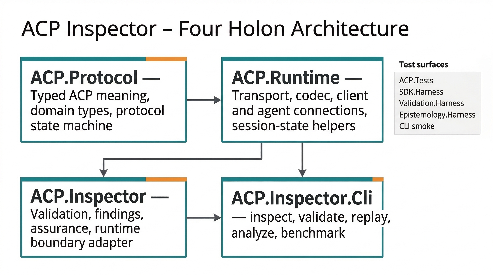
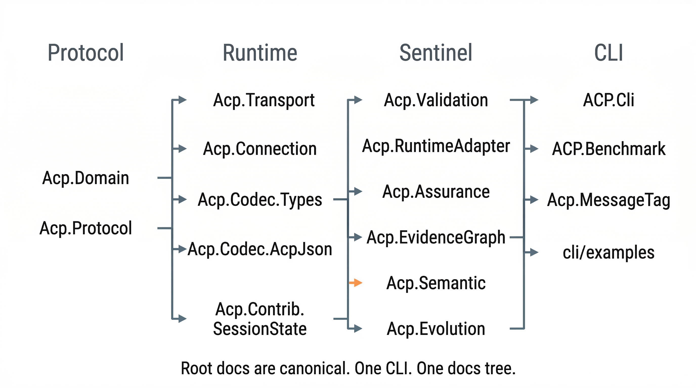
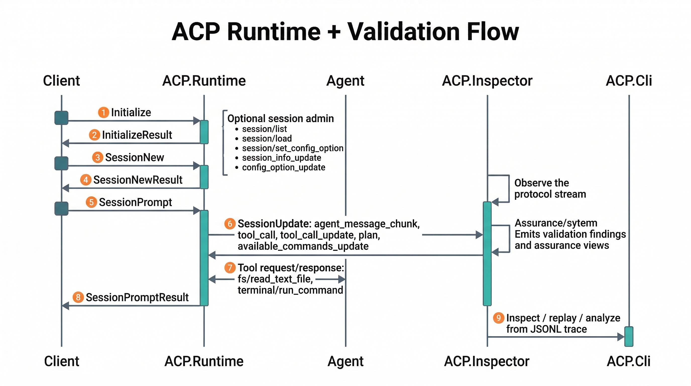

# Diagram Set - 2026-03-19

This diagram set captures the current ACP Inspector structure after the ACP stable parity and FPF refresh work.

## 1. Four Holon Architecture

Focus:

- package boundaries
- dependency direction
- test surfaces around the four holons

## 2. Module Map

Focus:

- high-signal module names per package
- repo shape after consolidating to one CLI and one docs tree

## 3. Runtime + Validation Flow

Focus:

- ACP session lifecycle
- streaming update path
- inspector/CLI observation path
- stable session admin additions (`session/list`, `session/load`, `session/set_config_option`)
